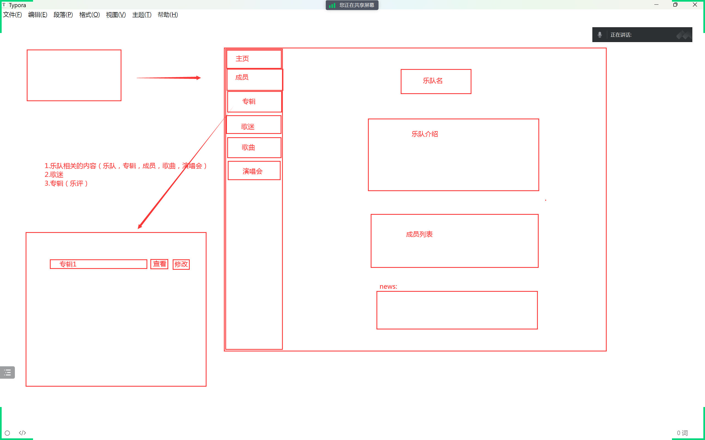

# IBase
​	一个用`C++`开发的**乐队数据管理软件**。以`ImGui`为图形界面，底层封装了`Mysql C API`连接池操作数据库。

## 环境说明

| 环境            | 版本     | 备注                                                         |
| --------------- | -------- | ------------------------------------------------------------ |
| `Windows`       | `11`     | https://www.microsoft.com/zh-cn/windows/windows-11           |
| `Visual Studio` | `vs2022` | [Visual Studio 2022 IDE - 适用于软件开发人员的编程工具 (microsoft.com)](https://visualstudio.microsoft.com/zh-hans/vs/) |
| `Navicat`       | `16`     | https://navicat.com.cn/                                      |

## 技术栈

| 技术              | 说明               | 版本     | 备注                                                         |
| ----------------- | ------------------ | -------- | ------------------------------------------------------------ |
| `MySQL Connector` | `MySQL`连接驱动库  | `8.0.27` | https://dev.mysql.com/downloads/connector/cpp/ https://dev.mysql.com/doc/connector-cpp/1.1/en/connector-cpp-apps.html |
| `OpenSSL`         | 开源安全套接层协议 | `1.1.1L` | https://www.openssl.org/ https://www.xolphin.com/support/OpenSSL/OpenSSL_-_Installation_under_Windows |
| `jsoncpp`         | `Mysql`配置文件    | `1.9.5`  | [open-source-parsers/jsoncpp: A C++ library for interacting with JSON. (github.com)](https://github.com/open-source-parsers/jsoncpp) |
| `ImGui`           | C++ Gui库          | `1.9.0`  | [ocornut/imgui: Dear ImGui: Bloat-free Graphical User interface for C++ with minimal dependencies (github.com)](https://github.com/ocornut/imgui) |

## 配置说明

### 数据库配置

​	对数据库使用`json`文件进行配置（**`dbConfig.json`文件**）。

| 配置选项   | 说明         |
| ---------- | ------------ |
| `ip`       | 主机名       |
| `port`     | 数据库端口   |
| `user`     | 用户名       |
| `password` | 密码         |
| `dbName`   | 使用的数据库 |
| `minSize`  | 最小连接数   |
| `maxSize`  | 最大连接数   |
| `timeOut`  | 连接超时时间 |

## 数据库设计

### ER图

### 设计图

### sql文件

## 前端演示

